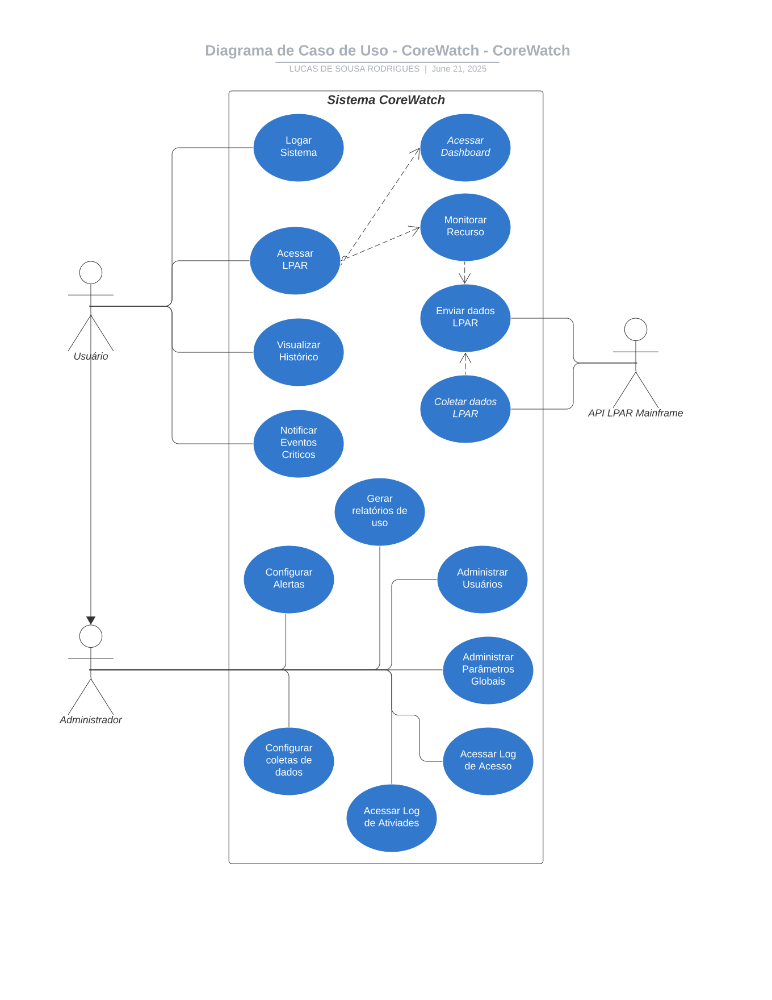

# Caso de Uso do Corewatch

Diagrama de Caso de Uso

Descrição do Caso de Uso

# Diagrama de Caso de Uso do CoreWatch

https://lucid.app/lucidchart/e4684e97-ff34-4a24-ad85-d5da1fd109d7/edit?viewport_loc=-261%2C75%2C2096%2C969%2C.Q4MUjXso07N&invitationId=inv_dec9cedb-7ca4-487d-b070-c1fc910569af

# Descrição do Caso de Uso do CoreWatch

| **ID** | **Caso de Uso** | **Atores** | **Descrição** | **Requisitos Contemplados** |
| --- | --- | --- | --- | --- |
| CDU1 | Logar Sistema | Usuário. | O usuário logará no sistema utilizando login e senha, providos anteriormente. | RF1; RNF1 |
| CDU2 | Acessar LPAR | Usuário. | O usuário poderá selecionar uma LPAR, das quais poderá ter acesso, para obter acesso a mais detalhes | RF3; RNF1; RNF4 |
| CDU3 | Acessar Dashboard | Usuário. | O usuário poderá selecionar um dashboard de visualização das informações vindas do mainframe. | RF3; RNF4 |
| CDU4 | Monitorar Recurso | Usuário. | O usuário poderá um recurso especifico para monitorar. | RF2; RFN4 |
| CDU5 | Configurar Alertas | Usuário. | O usuário poderá configurar os alertas de acordo com o impacto e urgência, e até desativando alertas em que não é necessária intervenção. | RF4; RNF4; RNF6 |
| CDU6 | Visualizar Histórico | Usuário. | O usuário poderá visualizar o histórico de alertas e de saúde da LPAR | RF5; RNF6 |
| CDU7 | Configurar Coleta de Dados | Usuário. | O usuário poderá configurar a frequência da coleta de no ambiente. | RF7; RNF6 |
| CDU8 | Notificar Eventos Criticos | Usuário. | O sistema notifica o usuário via e-mail ou SMS sobre um evento critico na LPAR. | RF8 |
| CDU9 | Administrar Usuários | Administrador. | O administrador poderá criar novos usuário e novos administradores. | RF9; RNF1 |
| CDU10 | Administrar parâmetros globais | Administrador. | O administrador poderá alterar os parâmetros globais do sistema. | RF10; RNF6 |
| CDU11 | Acessar Log de acesso | Administrador. | Todos os acessos deverão ser registrados em forma de log o momento do login e do logout. | RF11; RNF6 |
| CDU12 | Acessar Log de atividades | Administrador. | Todas as atividades disruptivas no sistema deverão ser armazenadas em forma de log. | RF12; RNF6 |
| CDU13 | Coletar dados LPAR | API. | A API deverá extrair da log da LPAR as informações pertinentes, e transformá-la no formato JSON. | RF1; RNF1; RNF2;RNF3; RNF5; RNF6; RNF7; RNF8 |
| CDU14 | Enviar dados LPAR | API. | A API deverá enviar o arquivo JSON para o sistema. | RF1;RNF1;RNF2; RNF3; RNF5; RNF6RNF8 |
| CDU15 | Gerar relatório de uso | Administrador. | O Administrador poderá gerar um relatório de uso da LPAR. | RF6;RNF6 |